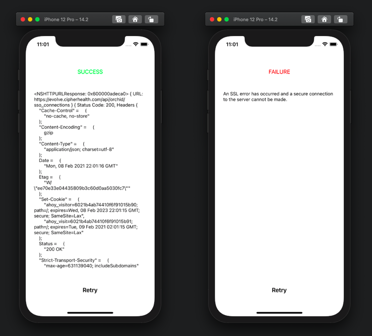

# SSLErrorSample (Apple TSI)
This is a sample project to demonstrate an issue related to ATS Exception domain key `NSRequiresCertificateTransparency` not working as expected on iOS 10 devices.
## Background
This issue has been detected when doing final QA before releasing a new version of our app [CipherRounds](https://apps.apple.com/es/app/cipherrounds/id787557015), which supports iPhone/iPad for versions from iOS 10+.

This app is used from within United States' Hospitals and security is very important, as it handles PHI data. One of the measures we implement to ensure security is to do `SSL Pinning` when communicating with our Private API. As part of next version changes, we are replacing it with `Certificate Transparency`.

To do this change, we have just added an exception domain within `App Transport Security Settings` that includes the exception domain key `NSRequiresCertificateTransparency` with Boolean true value.

When QAing this change, we have just realised it does not work on iOS 10 devices. For these devices the connection cannot be stablished, it fails during the SSL handshake.

To abstract this issue from our app's complexity, dependencies like AFNetworking, etc... I have created a sample project.
## Sample Project
This project is just doing a single NSURLSession request to one of our endpoints that doesn't require authentication. It has configured our hostname within an ATS domain exception to require Certificate Transparency.

When the app opens it will trigger the URL request, and depending in the result it will display:
- Success: It will display a green `Success` label and will print a description of the response received.
- Failure: It will display a red `Failure` label and will print a description of the error received.

 
 
 You can also retry request any time by clicking the `Retry` button.
 
 Within this sample project, I am  able to test both success and failure scenarios related to Certificate Transparency:
 - To test success you don't need to do anything special, just run the app normally and it should work.
 - To test failure scenario, I am using a proxy with a self signed root certificate (using [Charles](https://www.charlesproxy.com) or [Proxyman](https://proxyman.io)). This should fail to stablish a SSL connection.
 ## Steps to reproduce
To reproduce the problem, it is enough to run the project on an iOS 10 Device or Simulator. You will see that the app displays an error related to not being able to stablish a SSL connection.

__Note__: Our API is only accessible from within the United States for security reasons. If you are testing from any other country you will need to use a VPN, or you can use any other https url like `https://google.com`, where it also happens (you wil need to change ATS config in `Info.plist` file to match the new URL host).

The project is configured to show CFNetwork diagnostics, and this is the trace that is printed in console when it fails to connect.

```
Feb  8 23:31:20  SSLErrorSample[22717] <Notice>: CFNetwork Diagnostics [3:1] 22:31:20.009 {
	LoaderWhatToDo: (null)
	       Request: <CFURL 0x6080000d5690 [0x1076fde40]>{string = https://evolve.cipherhealth.com/api/orchid/sso_connections, encoding = 134217984, base = (null)}
	   CachePolicy: 0
	      WhatToDo: originload
	   CreateToNow: 0.03997s
	} [3:1]
Feb  8 23:31:20  SSLErrorSample[22717] <Notice>: CFNetwork Diagnostics [3:2] 22:31:20.017 {
	AddCookies Continue: request GET https://evolve.cipherhealth.com/api/orchid/sso_connections HTTP/1.1
	       HTTPProtocol: Task: c940a040
	} [3:2]
Feb  8 23:31:20  SSLErrorSample[22717] <Notice>: CFNetwork Diagnostics [3:3] 22:31:20.018 {
	DiskCookieStorage Construction: Binary{ Disk Cookies: { /Users/nacho/Library/Developer/CoreSimulator/Devices/693CF86A-2FA7-499F-98E0-95BFAE822A0F/data/Containers/Data/Application/522922BA-4D54-458A-8B22-D897259D2216/Library/Cookies/com.cipherhealth.sslerrorsample.SSLErrorSample.binarycookies, <0 cookies in 0 domains> clean not writing } }
	                     Accessing: <CFURL 0x6080000a8ca0 [0x1076fde40]>{string = file:///Users/nacho/Library/Developer/CoreSimulator/Devices/693CF86A-2FA7-499F-98E0-95BFAE822A0F/data/Containers/Data/Application/522922BA-4D54-458A-8B22-D897259D2216/Library/Cookies/com.cipherhealth.sslerrorsample.SSLErrorSample.binarycookies, encoding = 134217984, base = (null)}
	                          Path: /Users/nacho/Library/Developer/CoreSimulator/Devices/693CF86A-2FA7-499F-98E0-95BFAE822A0F/data/Containers/Data/Application/522922BA-4D54-458A-8B22-D897259D2216/Library/Cookies/com.cipherhealth.sslerrorsample.SSLErrorSample.binarycookies
	                Read from disk: <0 cookies in 0 domains>
	                         Dirty: NO
	                       Writing: NO
	                        Policy: 2
	} [3:3]
Feb  8 23:31:20  SSLErrorSample[22717] <Notice>: CFNetwork Diagnostics [3:4] 22:31:20.019 {
	DiskCookieStorage Journaling On: Binary{ Disk Cookies: { /Users/nacho/Library/Developer/CoreSimulator/Devices/693CF86A-2FA7-499F-98E0-95BFAE822A0F/data/Containers/Data/Application/522922BA-4D54-458A-8B22-D897259D2216/Library/Cookies/com.cipherhealth.sslerrorsample.SSLErrorSample.binarycookies, <0 cookies in 0 domains> clean not writing } }
	                           File: <CFURL 0x6080000a8dc0 [0x1076fde40]>{string = file:///Users/nacho/Library/Developer/CoreSimulator/Devices/693CF86A-2FA7-499F-98E0-95BFAE822A0F/data/Containers/Data/Application/522922BA-4D54-458A-8B22-D897259D2216/Library/Cookies/com.cipherhealth.sslerrorsample.SSLErrorSample.binarycookies, encoding = 134217984, base = (null)}
	} [3:4]
Feb  8 23:31:20  SSLErrorSample[22717] <Notice>: CFNetwork Diagnostics [3:5] 22:31:20.020 {
	HTTPCookieStorage::copyCookiesForURL: <CFHTTPCookieStorage 0x6000002822b0 [0x6000002822c0]>
	                         Request URL: https://evolve.cipherhealth.com/api/orchid/sso_connections
	                    MainDocument URL: NONE
	} [3:5]
Feb  8 23:31:20  SSLErrorSample[22717] <Notice>: CFNetwork Diagnostics [3:6] 22:31:20.021 {
	Protocol Enqueue: request GET https://evolve.cipherhealth.com/api/orchid/sso_connections HTTP/1.1
	         Request: <CFURLRequest 0x6080001a32c0 [0x1076fde40]> {url = https://evolve.cipherhealth.com/api/orchid/sso_connections, cs = 0x0}
	         Message: GET https://evolve.cipherhealth.com/api/orchid/sso_connections HTTP/1.1
	         Sending: dict [3] {
	                      Accept-Encoding: gzip, deflate
	                               Accept: */*
	                      Accept-Language: en-us
	                  }
	} [3:6]
Feb  8 23:31:20  SSLErrorSample[22717] <Notice>: CFNetwork Diagnostics [3:7] 22:31:20.021 {
	SocketStream IO Logging: (null)
	} [3:7]
Feb  8 23:31:20  SSLErrorSample[22717] <Notice>: CFNetwork Diagnostics [3:8] 22:31:20.049 {
	TCP Connection Start: (null)
	          Connection: 0x600000198390
	       Connection ID: 1
	} [3:8]
Feb  8 23:31:20  SSLErrorSample[22717] <Notice>: CFNetwork Diagnostics [3:9] 22:31:20.376 {
	TCP Connection Connected: (null)
	              Connection: 0x600000198390
	           Connection ID: 1
	                   Error: 0
	} [3:9]
Feb  8 23:31:20  SSLErrorSample[22717] <Notice>: CFNetwork Diagnostics [3:10] 22:31:20.815 {
	Authentication Challenge: (null)
	                  Loader: <CFURLRequest 0x6080001a2300 [0x1076fde40]> {url = https://evolve.cipherhealth.com/api/orchid/sso_connections, cs = 0x0}
	               Challenge: challenge space https://evolve.cipherhealth.com:443/, ServerTrustEvaluationRequested (Hash bd14125de5ca8e8d)
	} [3:10]
Feb  8 23:31:20  SSLErrorSample[22717] <Notice>: CFNetwork Diagnostics [3:11] 22:31:20.816 {
	Use Credential: (null)
	        Loader: <CFURLRequest 0x6080001a2300 [0x1076fde40]> {url = https://evolve.cipherhealth.com/api/orchid/sso_connections, cs = 0x0}
	    Credential: null
	} [3:11]
Feb  8 23:31:20  SSLErrorSample[22717] <Notice>: CFNetwork Diagnostics [3:12] 22:31:20.816 {
	 touchConnection: (null)
	          Loader: <CFURLRequest 0x6080001a2300 [0x1076fde40]> {url = https://evolve.cipherhealth.com/api/orchid/sso_connections, cs = 0x0}
	Timeout Interval: 60.000 seconds
	} [3:12]
Feb  8 23:31:20  SSLErrorSample[22717] <Notice>: CFNetwork Diagnostics [3:13] 22:31:20.853 {
	Response Error: (null)
	       Request: <CFURLRequest 0x6080001a32c0 [0x1076fde40]> {url = https://evolve.cipherhealth.com/api/orchid/sso_connections, cs = 0x0}
	         Error: Error Domain=kCFErrorDomainCFNetwork Code=-1200 "(null)" UserInfo={_kCFStreamPropertySSLClientCertificateState=0, kCFStreamPropertySSLPeerTrust=<SecTrustRef: 0x6000001345a0>, _kCFNetworkCFStreamSSLErrorOriginalValue=-9802, _kCFStreamErrorDomainKey=3, _kCFStreamErrorCodeKey=-9802, kCFStreamPropertySSLPeerCertificates=(
	                    "<cert(0x7fb6ca81ca00) s: evolve.cipherhealth.com i: DigiCert SHA2 Extended Validation Server CA>",
	                    "<cert(0x7fb6ca801e00) s: DigiCert SHA2 Extended Validation Server CA i: DigiCert High Assurance EV Root CA>"
	                )}
	} [3:13]
Feb  8 23:31:20  SSLErrorSample[22717] <Notice>: CFNetwork Diagnostics [3:14] 22:31:20.870 {
	           Did Fail: (null)
	             Loader: <CFURLRequest 0x6080001a2300 [0x1076fde40]> {url = https://evolve.cipherhealth.com/api/orchid/sso_connections, cs = 0x0}
	              Error: Error Domain=kCFErrorDomainCFNetwork Code=-1200 "(null)" UserInfo={_kCFStreamPropertySSLClientCertificateState=0, kCFStreamPropertySSLPeerTrust=<SecTrustRef: 0x6000001345a0>, _kCFNetworkCFStreamSSLErrorOriginalValue=-9802, _kCFStreamErrorDomainKey=3, _kCFStreamErrorCodeKey=-9802, kCFStreamPropertySSLPeerCertificates=(
	                         "<cert(0x7fb6ca81ca00) s: evolve.cipherhealth.com i: DigiCert SHA2 Extended Validation Server CA>",
	                         "<cert(0x7fb6ca801e00) s: DigiCert SHA2 Extended Validation Server CA i: DigiCert High Assurance EV Root CA>"
	                     )}
	init to origin load: 0.045343s
	         total time: 0.901897s
	        total bytes: 0
	} [3:14]
Feb  8 23:31:20  SSLErrorSample[22717] <Notice>: CFNetwork Diagnostics [3:15] 22:31:20.911 {
	~HTTPProtocol: nullptr request
	      Request: null
	         sent: 0
	     received: 0
	    cell sent: 0
	cell received: 0
	} [3:15]
Feb  8 23:31:22  SSLErrorSample[22717] <Notice>: CFNetwork Diagnostics [3:16] 22:31:22.020 {
	DiskCookieStorage Sync Request: (null)
	                        Forced: no
	                       isDirty: no
	                     isWriting: no
	                          File: <CFURL 0x6080000a9420 [0x1076fde40]>{string = file:///Users/nacho/Library/Developer/CoreSimulator/Devices/693CF86A-2FA7-499F-98E0-95BFAE822A0F/data/Containers/Data/Application/522922BA-4D54-458A-8B22-D897259D2216/Library/Cookies/com.cipherhealth.sslerrorsample.SSLErrorSample.binarycookies, encoding = 134217984, base = (null)}
	                       Journal: yes
	                     Mutations: 0
	} [3:16]
```
